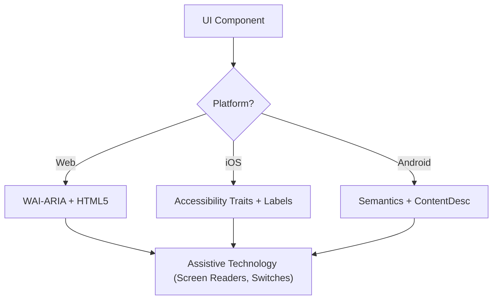

# アクセシビリティ (Accessibility)（WCAG 2.2）

この skill は、screen reader、switch control、keyboard navigation を利用する user を含め、すべての user に対して digital interface が Perceivable、Operable、Understandable、Robust（POUR）であることを保証する。WCAG 2.2 success criterion の technical implementation に焦点を当てる。

## 使用タイミング (When to Use)

- Web、iOS、Android 向け UI component specification を定義するとき
- 既存 code の accessibility barrier または compliance gap を監査するとき
- Target Size (Minimum) や Focus Appearance など新しい WCAG 2.2 standard を実装するとき
- 高レベル design requirement を technical attribute（ARIA role、trait、hint）に map するとき

## コア概念 (Core Concepts)

- **POUR Principles**: WCAG の基盤（Perceivable、Operable、Understandable、Robust）
- **Semantic Mapping**: built-in accessibility を提供するため、generic container より native element を優先
- **Accessibility Tree**: assistive technology が実際に「読む」UI の表現
- **Focus Management**: keyboard/screen reader cursor の順序と可視性を制御
- **Labeling & Hints**: `aria-label`、`accessibilityLabel`、`contentDescription` による context 提供

## 仕組み (How It Works)

### ステップ 1: Component Role の特定 (Step 1: Identify the Component Role)

functional purpose（button、link、tab など）を決定する。custom role に頼る前に、利用可能な最も semantic な native element を使う。

### ステップ 2: Perceivable Attribute の定義 (Step 2: Define Perceivable Attributes)

- text contrast が **4.5:1**（通常）または **3:1**（large/UI）を満たすこと
- non-text content（image、icon）に text alternative を追加
- responsive reflow を実装（400% zoom まで function を失わない）

### ステップ 3: Operable Control の実装 (Step 3: Implement Operable Controls)

- 最小 **24x24 CSS pixel** の target size（WCAG 2.2 SC 2.5.8）
- すべての interactive element が keyboard で到達可能で visible focus indicator があること（SC 2.4.11）
- dragging movement に single-pointer alternative を提供

### ステップ 4: Understandable Logic の確保 (Step 4: Ensure Understandable Logic)

- 一貫した navigation pattern を使用
- descriptive error message と correction suggestion を提供（SC 3.3.3）
- 「Redundant Entry」（SC 3.3.7）を実装し、同じ data を二度求めない

### ステップ 5: Robust Compatibility の検証 (Step 5: Verify Robust Compatibility)

- 正しい `Name, Role, Value` pattern を使用
- dynamic status update 向けに `aria-live` または live region を実装

## アクセシビリティ Architecture 図 (Accessibility Architecture Diagram)



## クロスプラットフォーム Mapping (Cross-Platform Mapping)

| Feature            | Web (HTML/ARIA)          | iOS (SwiftUI)                        | Android (Compose)                                           |
| :----------------- | :----------------------- | :----------------------------------- | :---------------------------------------------------------- |
| **Primary Label**  | `aria-label` / `<label>` | `.accessibilityLabel()`              | `contentDescription`                                        |
| **Secondary Hint** | `aria-describedby`       | `.accessibilityHint()`               | `Modifier.semantics { stateDescription = ... }`             |
| **Action Role**    | `role="button"`          | `.accessibilityAddTraits(.isButton)` | `Modifier.semantics { role = Role.Button }`                 |
| **Live Updates**   | `aria-live="polite"`     | `.accessibilityLiveRegion(.polite)`  | `Modifier.semantics { liveRegion = LiveRegionMode.Polite }` |

## 例 (Examples)

### Web: アクセシブル Search (Web: Accessible Search)

```html
<form role="search">
  <label for="search-input" class="sr-only">Search products</label>
  <input type="search" id="search-input" placeholder="Search..." />
  <button type="submit" aria-label="Submit Search">
    <svg aria-hidden="true">...</svg>
  </button>
</form>
```

### iOS: アクセシブル Action Button (iOS: Accessible Action Button)

```swift
Button(action: deleteItem) {
    Image(systemName: "trash")
}
.accessibilityLabel("Delete item")
.accessibilityHint("Permanently removes this item from your list")
.accessibilityAddTraits(.isButton)
```

### Android: アクセシブル Toggle (Android: Accessible Toggle)

```kotlin
Switch(
    checked = isEnabled,
    onCheckedChange = { onToggle() },
    modifier = Modifier.semantics {
        contentDescription = "Enable notifications"
    }
)
```

## 避けるべき Anti-Pattern (Anti-Patterns to Avoid)

- **Div-Buttons**: role と keyboard support なしで click event に `<div>` や `<span>` を使う
- **Color-Only Meaning**: error や status を color 変更のみで示す（例: border を red にするだけ）
- **Uncontained Modal Focus**: focus を trap しない modal — keyboard user が modal 表示中も background を操作できる。focus は contain し、`Escape` または explicit close button で escapable にする（WCAG SC 2.1.2）
- **Redundant Alt Text**: alt text で "Image of..." や "Picture of..." を使う（screen reader は既に "Image" role を announce する）

## ベストプラクティス Checklist (Best Practices Checklist)

- [ ] interactive element が **24x24px**（Web）または **44x44pt**（Native）target size を満たす
- [ ] focus indicator が明確に visible で high-contrast
- [ ] modal は open 中 **focus を contain** し、close 時に clean に release（`Escape` または close button）
- [ ] dropdown/menu は close 時に trigger element へ focus を restore
- [ ] form が text-based error suggestion を提供
- [ ] icon-only button すべてに descriptive text label がある
- [ ] text scale 時に content が適切に reflow する

## 参照 (References)

- [WCAG 2.2 Guidelines](https://www.w3.org/TR/WCAG22/)
- [WAI-ARIA Authoring Practices](https://www.w3.org/TR/wai-aria-practices/)
- [iOS Accessibility Programming Guide](https://developer.apple.com/documentation/accessibility)
- [iOS Human Interface Guidelines - Accessibility](https://developer.apple.com/design/human-interface-guidelines/accessibility)
- [Android Accessibility Developer Guide](https://developer.android.com/guide/topics/ui/accessibility)

## 関連 Skill (Related Skills)

- `frontend-patterns`
- `design-system`
- `liquid-glass-design`
- `swiftui-patterns`
